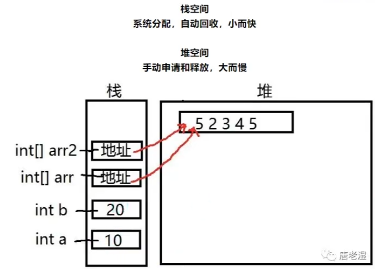
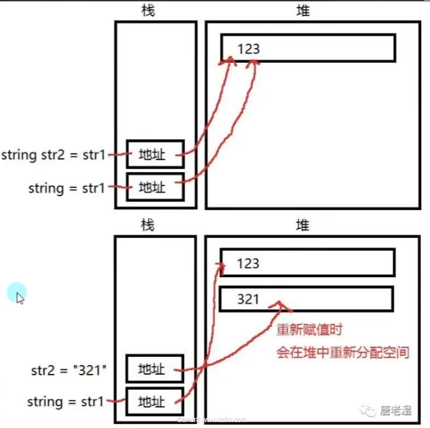
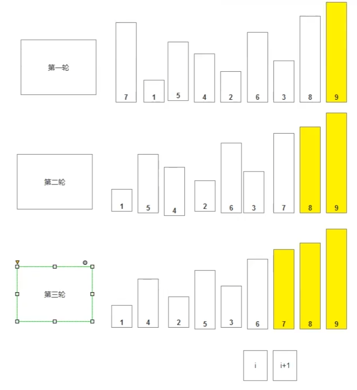
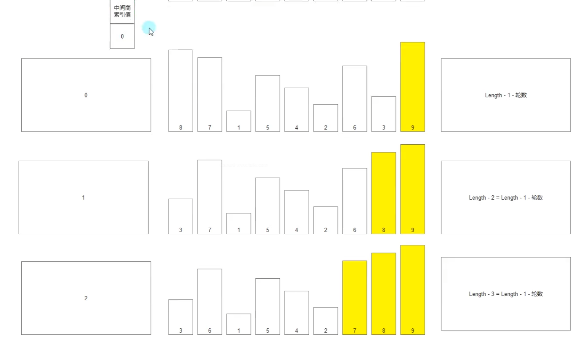

# Csharp基础笔记

## 注释

```
//            -->单行注释
/* text */    -->多行注释
///           -->用于解释类和方法的
```

## 变量类型

1bit(位) = 0/1
1byte = 8bit
1kb = 1024byte
1mb = 1024kb

有符号数：
sbyte   (-128~127) == 2<sup>8</sup>
int     (正负21e多) == 2<sup>32</sup>
short   (正负3w多) == 2<sup>16</sup>
long    (正负900w兆多) == 2<sup>64</sup>

无符号数：
byte    0~255    2<sup>8</sup>
uint    0~42e    2<sup>32</sup>
ushort    2<sup>16</sup>

ulong    2<sup>64</sup>

浮点数：

float    2<sup>32</sup>    存储7/8位有效数字，遵循四舍五入（有效数字从左到右非零数开始数）

c#中声明的小数默认是double类型，所以float类型需要加上f

double    2<sup>64</sup>    存储15~17位有效数字

decimal    2<sup>128</sup>    存储27~28位有效数字，不建议使用，使用需在后面加m

特殊类型：

bool    true false    真与假

char    存储单个字符

string    字符串类型，存储多个字符，无上限

## 常量

必须初始化，不能被修改

关键字 const

固定写法const 变量类型 变量名 = 初始值；

const int num = 20;

## 转义字符

固定写法：\字符

单引号    \'

双引号    \"

换行    \n

不常用

制表符    \t    tap

光标退格    \b    光标往前一个

空字符    \0 

警报音    \a    警告音效

取消转义字符    在字符串前面加上@    字符串里的转义字符就没用

## 类型转换

类型转换就是不同变量类型之间的相互转换

## 运算符

三目运算符：表达式？真执行：假执行

### 隐式转换

不同类型之间自动转换（大范围装小范围）

例：int变量赋值给long变量，是允许的，遵循规则，而long不能赋值给int

decimal类型不能用隐式转换去存储double和float，但是可以隐式存储整形

特殊类型之间不存在隐式转换

有符号的变量不能隐式转换成无符号

无符号数范围小于有符号数是可以隐式转换

浮点数可以装载任何类型的整数

### 显式转换

作用：一般情况下将高精度类型强制转换为低精度

语法：变量类型 变量名 = （变量类型）变量；

Parse方法

作用：把字符串类型转换为对应的类型

语法：变量类型.Parse("字符串")

Convert方法

作用：更准确的将各个类型进行转换

语法Convert.To目标类型(变量或常量)

其他类型转string（toString方法）

作用：拼接打印

语法：变量.toString();

## 异常捕获

解决代码报错时造成程序卡死

语法：

```csharp
try{
    // 希望进行异常捕获的代码，报错了不会让程序卡死
}
catch{
    // 出错执行的代码
    // catch(Exception e) 具体报错追踪，通过e得到具体报错信息
}
// 可选
finally{
    //最后执行的代码，不管有没有出错，都会执行
}
```

## 控制台相关

```csharp
// 输出
Console.WriteLine();
Console.Write();
// 输入
Console.ReadLIne();
COnsole.ReadKey(); // 检测按键
// 清空
Console.Clear();
// 设置控制台大小
Console.SetWindowSize(); //设置窗口大小
Console.SetBufferSize(); //设置缓冲区大小
// 设置光标位置
Console.SetCursorPosition(x,y);
// 设置文字颜色
Console.ForegroundColor = ConsoleColor.Red;
// 设置背景颜色
Console.BackgroundColor = ConsoleColor.Green;
// 光标显隐
Console.CursorVisible = false;
// 关闭控制台
Environment.Exit(0);
```

## 访问修饰符

修饰结构体中变量和方法是否能被外部使用

public    公共的，能被外部访问

private    私有的，只能在内部使用

protected    保护的，自己内部和子类才能访问

默认为private

## 复杂数据类型

### 枚举

整型常量的集合，可自定义

作用：游戏开发中，对象很多时候会有很对状态，这时候需要一个变量或标识来表示当前对象处于什么状态。一般情况下是用int来表示状态

如1代表行走，2代表跑步，3代表跳跃，这种纯数字不能很清晰的表达状态含义，所以可以利用枚举来定义状态

注意：只能在命名空间和类中声明，不能在函数和方法中声明

```csharp
//声明枚举,默认值从0开始
enum E_name {str1, str2, str3};
enum E_name {str1 = 1, str2 = 3, str3};
//声明枚举变量
E_name playerName = E_name.str1;    // "str1"
//枚举类型转换
int i = (int)playerName;    // 0
string str = playerName.ToString();    //"str1"
playerName = (E_name)Enum.Parse(typeof(E_name),"str2");    //"str2"
//
E_name coffeeType = (E_name)input;    //input:2 => coffeeType:"str3"
```

### 数组（array）

---

[C#中数组、ArrayList和List三者的区别_数组和列表的主要区别 c#_zhang_xinxiu的博客-CSDN博客](https://blog.csdn.net/zhang_xinxiu/article/details/8657431)

任意变量类型顺序存储的数据

概念：存储一组相同类型的集合

注意：不支持负数下标，初始化后不能直接添加新元素和删除元素

```csharp
//声明：变量类型[] 数组名;
int[] arr1;
//初始化
int[] arr1 = new int[3];    //[0,0,0]
int[] arr1 = new int[3] { 1,2,3 };    //[1,2,3]
int[] arr1 = { 1,2,3 };    //[1,2,3]
int[] arr1 = new int[] { };    //占用内存空间，但无确定的值
```

### 二维数组

```csharp
//声明
int[,] arr;
int[,] arr = {{1,2},{4,5}};
```

### 交错数组

行固定，列不固定的数组

```csharp
//声明
int[][] arr;
int[][] arr = {
new int[]{1,2,3},
new int[]{4,5}
};
```

### 结构体

结构体是值类型数据结构。它使得一个单一变量可以存储各种数据类型的相关数据，它是数据和函数的集合，在结构体中可以声明各种变量和方法

作用：用来表现存在关系的数据集合，比如用结构体表现学生、动物、人类等。

结构体一般写在namespace语句块中

```csharp
namespace 结构体{
    //声明结构体
    struct Student{
        //变量，不能初始化
        int age;
        bool sex;
        string name;
        //构造函数
        //不允许声明无参构造函数，而在类中则可以

        //方法
        void Speak(){
            Console.WriteLine(name);
        }
    }
    //使用结构体
    Student s1;
}
```

类与结构区别

- 类是引用类型，结构是值类型。

- 结构不支持继承。

- 结构不能声明默认的构造函数。

#### 构造函数

用于在外部方便初始化

```csharp
//没有返回值
//函数名必须和构造体一样
//必须有参数
//声明了构造函数就必须对所有变量数据初始化
public Student(int age,bool sex,string name){
    this.age = age;
    this.sex = sex;
    this.name = name;
}
```

## 值类型和引用类型

引用类型：string，数组，类

值类型：有无符号整型、浮点数、char、bool、结构体

区别：存储在的内存区域不同，引用类型引用的是内存地址

值类型存储在栈空间（系统分配，自动回收，小而快）

引用类型存储在堆空间（手动申请和释放，大而慢）



### string（特殊引用类型）

具备值类型的特征，重新赋值时，回开辟新的内存空间

缺点：频繁赋值会产生内存垃圾（垃圾需要消耗一些性能去清除）



## 函数

函数（方法）是封装代码进行重复使用的一种机制

声明在哪：class或struct(结构体)语句块中

```csharp
//基本语法
//访问修饰符 返回类型 函数名(参数类型 参数名1，参数类型 参数名2,...){return 返回值}
//例子
static int NumPlus(int numOne,int numTwo){
    return numOne+numTwo;
}
//函数名使用帕斯卡命名法命名：每个单词首个字母大写
//myName(驼峰)    MyName(帕斯卡)
//参数名用驼峰命名法
```

- **Access Specifier**：访问修饰符，这个决定了变量或方法对于另一个类的可见性。
- **Return type**：返回类型，一个方法可以返回一个值。返回类型是方法返回的值的数据类型。如果方法不返回任何值，则返回类型为 **void**。
- **Method name**：方法名称（函数名），是一个唯一的标识符，且是大小写敏感的。它不能与类中声明的其他标识符相同。
- **Parameter list**：参数列表，使用圆括号括起来，该参数是用来传递和接收方法的数据。参数列表是指方法的参数类型、顺序和数量。参数是可选的，也就是说，一个方法可能不包含参数。
- **Method body**：方法主体，包含了完成任务所需的指令集。

```csharp
namespace test
{
    class myTest
    {
        int loop = 0;           //实例成员变量
        static int num  = 0;    //静态成员变量
        public static int value = 10; //全局变量

        void Main()
        {
            int m = 0;          //局部变量

            for (int i = 0; i < 100; i++)
            {
                //i为局部变量，其作用域仅为for循环体内
                Console.WriteLine(i);
            }
        }
    }
}
```

成员变量：在类中定义的变量，在整个类中都有效，类中定义的方法都可以使用该变量。成员变量又可以分为实例成员变量和静态成员变量。

静态成员变量：使用static修饰的成员变量，static用于把属性和方法绑定到类本身，而不是使用类创建的对象。使用静态成员变量时直接使用类名称进行调用，无论用户使用该类创建了多少个对象，静态成员变量始终只有一个，始终绑定到类本身，每个创建的对象中并不存在该静态成员变量。
实例成员变量：实例成员变量是绑定使用类创建的对象上的，要想使用实例成员变量，必须先使用类创建一个对象。使用实例成员变量时是使用对象名进行调用，使用同一类创建的多个对象中各自有自己的实例成员变量，互相隔离，互不干扰。

局部变量：在方法体中定义的变量，其使用范围只局限在定义它的方法之中或者方法之中的循环体之内，[作用域](https://so.csdn.net/so/search?q=%E4%BD%9C%E7%94%A8%E5%9F%9F&spm=1001.2101.3001.7020)不超过一个大括号

全局变量：在类中定义的变量用[static](https://so.csdn.net/so/search?q=static&spm=1001.2101.3001.7020)修饰的变量为全局变量，在整个namespace中的所有类中都可以使用

### ref和out

函数参数的修饰符，当传入的值类型参数在内部修改时，或引用类型参数在内部重新声明时，使外部的值发生改变

区别：

ref传入的变量必须初始化，out不用

out传入的变量必须在内部赋值，ref不用

```csharp
int value1 = 1;
int value2;
static void ChangeValueRef(ref int value1){
    //函数外value1必须初始化，new和赋值
    value1 = 3;
}// value => 3
static void ChangeValueOut(out int value2){
    //必须对内部value2赋值
    value2 = 3;
}// value => 3
```

### 参数

变长参数，可变参数

在不确定参数长度时，在最后一个参数前面加上params

params后跟数组类型

传入实参时，会默认把标记params的位置后面的参数作为数组传入

```csharp
参数("nihao", 1, 2, 3, 4);    // str:nihao,i:3
static void 参数(string str, params int[] i)
{
    Console.WriteLine("str:{0},i:{1}",str,i[2]);
}
//参数里赋值则为设置默认值（也叫可选参数）
//可选参数只能放在普通参数后面
参数2(10);    // num:10,str:你好
static void 参数2(int num, string str = “你好”)
{
    Console.WriteLine("num:{0},str:{1}",num,str);
}
```

### 重载

在同一语句块中（class或struct）中，函数名相同，参数数量不同或者参数数量相同，参数的类型或顺序不同

作用：命名一组功能相似的函数，减少函数名使用，避免命名空间污染。提升程序可读性

注意：重载和返回值类型无关，只和参数类型，个数，顺序有关。调用时，程序会根据传入的参数类型判断使用哪一个重载。

ref和out添加进参数中也算重载，因为相当于改变了参数的类型

可选参数不能算重载

### 递归函数

让函数自己调用自己（函数嵌套）

## 面向对象

面向对象是一种对现实世界理解和抽象的编程方法，把相关的数据和方法组织为一个整体来看待，从更高的层次来进行程序开发，更贴近事物的自然运行模式

面向对象七大原则

开闭原则、依赖倒转原则、里氏替换原则、单一职责原则、接口隔离原则、合成复用原则、迪米特法则

### 封装

用程序语言来形容对象

#### 类和对象

声明在namespace语句块中

```csharp
//命名使用帕斯卡命名法
//同个namespace不能有重名类
class 类名{
    //特征 - 成员变量
    //行为 - 成员方法
    //保护特征 - 成员属性

    //构造函数和析构函数
    //索引器
    //运算符重载
    //静态成员
}

//实例化对象
类名 变量名；
类名 变量名 = null;
类名 变量名 = new 类名();
//前两种实例化只是在栈上分配了一个空间来存储在堆上的地址，栈上的地址为null
//new实例化在栈上存了类在堆上的地址，所以类的实际内容其实是在堆上
```

#### 成员变量和访问修饰符

基本规则：

1. 声明在类语句块中

2. 用来描述对象的特征

3. 可以是任意变量类型

4. 数量无限制，是否赋值根据需求

```csharp
enum E_SexType{
    Man,
    Woman,
}
class Person{
    string name = "Alex"
    int age;
    E_SexType sex;
    Person gridFriend;
}
//值类型不初始化，数字类型为0，bool类型为false
//引用类型为null
//可以用default(类型)，来看相应类型的默认值
```

#### 成员方法

用来表现对象的行为

注意：

- 不要加static关键字

- 受访问修饰符影响

```csharp
class Person{
    string name;
    public void PrintName(){
        Console.WriteLine(name);
    }
}
```

#### 构造函数

在实例化对象时，会调用的用于初始化的函数，不写的话默认存在一个无参构造函数

构造函数可以被重载，this代表当前调用该函数的对象自己

注意：实现有参构造函数会失去默认的无参构造函数（除非自己实现无参构造函数）

```csharp
class Person{
    public string name;
    int age;
    //构造函数，没有返回值，命名要与类名相同，没有特殊需求一般都是public
    public Person(){
        name = "Alex";
        age = 10;
    }
    public Person(string name){
        this.name = name;
    }
    public Person(string name, int age){
        this.name = name;
        this.age = age;
    }
    //特殊用法
    public Person(string name, int age):this(name)
    {
        this.age = 10;    // name => this.name    age = 10
    }
    //这里的this(name)会把传进来的参数name先递给
    //一个参数（string name）的构造函数去调用，然后才接着执行本体的构造函数
    //this(name, age, sex, ...)
    //可填入多个参数，顺序按照指向的构造函数参数列表进行传递
    //this(name+"Hele", age+10, ...)这种里面写表达式没问题
}
```

#### 析构函数

- 当引用类型的堆内存被回收时，会调用该函数

- 对于需要手动管理内存的语言（c++），需要在析构函数中做一些内存回收处理

- c#中存在自动垃圾回收机制GC

- c#几乎不会用到析构函数，除非想在某一个对象在被垃圾回收时做一些特殊处理

- unity开发中析构函数几乎不会使用

```csharp
//语法
~类名(){}
```

#### 垃圾回收机制

- 垃圾回收，简写GC(Garbage Collector)

- 垃圾回收的过程是在遍历堆（Heap）上动态分配的所有对象

- 通过识别它们是否被引用来确定哪些对象是垃圾，哪些对象仍要被使用

- 所谓的垃圾就是没有被任何变量，对象引用的内容，垃圾就需要被回收释放

- 垃圾回收有许多中算法，例如

- 引用计数(Reference Counting)

- 标记清除(Mark Sweep)

- 标记整理(Mark Compact)

- 复制集合(Copy Collection)

#### 成员属性

- 用于保护成员变量

- 为成员属性的获取和赋值添加逻辑处理

- 解决3p(public,private,protected)局限性

- 属性可以让成员变量在外部只能获取 不能修改 或者 只能修改 不能获取

tips：在VS中，输入prop按两下Tap可自动生成属性

```csharp
//语法    使用帕斯卡命名
访问修饰符 属性类型 属性名{ get{} set{} }
class Person{
    private string name;
    private int age;
    //使用帕斯卡命名
    public string Name{
        //get set前可加访问修饰符，默认使用public
        //不能都让set get的访问权限都低于属性的权限
        //get set可以只有一个
        get{
            //可添加一些逻辑规则
            return name; 
        }
        set{
            //可添加一些逻辑规则
            //value关键字用于表示外部传入的值
            name = value;
        }
    }
    //自动属性，外部能得不能改的特征，前提是没什么特殊处理，那可以用
    //相当于private Height;    但是有了外部能得不能改的特征
    public float Height{
        get;
        private set;
    }
}
//使用
Person p = new Person();
p.Name = "Alex";    //会调用属性中的set，并且value == "Alex"
Console.WriteLine(p.Name);    //"Alex"，调用的是属性中的get，返回name
```

#### 索引器

让对象可以像数组一样通过索引访问其中元素，使程序看起来更直观，更容易编写

比较适用于在类中有数组变量时使用，可以方便的访问和进行逻辑处理

注意：索引器可以重载，结构体里面也是支持索引器的

```csharp
访问修饰符 返回值 this[参数列表] { get{} set{} }

class Student
{
    private int age;
    private float unityScore;
    private float cSharpScore;
    private string sex;
    private Student[] friends;
        //索引器
        public Student this[int index]
        {
            get
            {
                if (friends == null || friends.Length-1 < index)
                {
                    return null;
                }
                return friends[index];
            }
            set
            {
                friends[index] = value;
            }
        }
}
Student s = new Student();
```

#### 静态成员

用static修饰的成员变量、方法、属性等，称为静态成员。

静态变量 一般用于常用的唯一变量的声明，方便别人获取的对象声明，如PI=3.14159

静态方法 常用的唯一方法声明，如相同规则的数学计算函数

特点：

- 程序开始运行时就会分配内存空间，所以可以直接用类名点出使用

- 只要使用了静态成员，直到程序结束时内存空间才会被释放

- 所以静态成员就会有自己唯一的一个“内存小空间”，使得成员变量有了唯一性

- 任何地方使用都是用的小房间里的内容，改变了它也是改变的小房间内容

注意：

- 静态函数中不能使用非静态成员

```csharp
class Person {
    public static int num = 10;
    public static void Speak(){
        Console.WriteLine("Hello static");
    }
}
//使用
Console.WriteLine(Person.num);    // 10
Console.WriteLine(Person.Speak());    // Hello static
```

与常量的区别：

- const可以理解为特殊的static

- 相同点：他们都能通过类名点出使用

- 不同点：const必须初始化，而且不能修改。const只能修饰变量。const一定写在访问修饰符后面

#### 静态类

用static修饰的类

特点：只能包含静态成员，不能被实例化。

作用：将常用的静态成员写在静态类中，方便使用，静态类不能被实例化，体现工具类的唯一性。例如Console就是一个静态类

```csharp
static class Person {
    public static void Speak(){
        Console.WriteLine("Hello Static Class");
    }
}
```

##### 静态构造函数

构造函数中加上static

特点：静态类和普通类都可以有，不能使用访问修饰符，不能有参数，只会自动调用一次

作用：在静态构造函数中初始化 静态变量

```csharp
static class StaticClass{
    public static int testInt = 100;
    public static int testInt2 = 100;
    static StaticClass(){
        Console.WriteLine("只会自动调用一次");
    }
}
//使用
StaticClass.testInt
StaticClass.testIn2
//输出
"只会自动调用一次"
100
200


class Test{
    public static int num1 = 10;
    public int num2 = 10;
    static Test(){
        Console.WriteLine("静态构造");
    }
    public Test(){
        Console.WriteLine("普通构造");
    }
}
//使用
Test t = new Test();
t.num;
//输出
"静态构造"
10
"普通构造"
--------------------------------
//使用
Test.num1
//输出
"静态构造"
10
```

#### 拓展方法

为现有非静态 变量类型 添加 新方法（类也是一种变量类型）

作用：

- 提升程序拓展性

- 不需要在对象中重新写方法

- 不需要继承来添加方法

- 为别人封装的类型写额外的方法

特点：

- 一定写在静态类中

- 一定是个静态函数

- 第一个参数为拓展目标

- 第一个参数用this修饰

- 支持重载

```csharp
//访问修饰符 static 返回值 函数名(this 拓展类名 参数名，参数类型 参数名,...)
static class Tools{
    //为int拓展了一个成员方法
    //成员方法 是需要 实例化对象后 才 能使用的
    //value 代表 使用该方法的 实例化对象
    public static int AddOne(this int value){
        return value + 1;
    }
    public static int AddOne(this int value, int a, int b)
    {
        return value + a + b;
    }
    public static void Fun3(this Test t)
    {
        Console.WriteLine("为test拓展的方法");
    }
}
class Test {
    public int i = 10;
    public void Fun1(){
        Console.WriteLine("123");
    }
}
//使用
int i = 10;
i.AddOne()    // 11
i.AddOne(3,4)    // 17
Test t = new Test();
t.Fun3();    //"为test拓展的方法"
```

### 继承

复用封装对象的代码，儿子继承父亲，复用现成代码

### 多态

同样行为的不同表现，儿子继承父亲的基因但有不同的行为表现

## 排序

### 冒泡排序



```csharp
static void 冒泡排序(int[] arr)
        {
            int temp = 0;
            //排序规则：从左到右，前后两个值一一比较
            //并置换位置，直到全部值满足规则
            bool isSort = false;
            //每轮循环
            for (int n = 0; n < arr.Length; n++)
            {
                isSort = false;
                //一轮循环
                for (int i = 0; i < arr.Length - (1+n); i++)
                {
                    //升序判断
                    if (arr[i] > arr[i + 1])
                    {
                        isSort = true;
                        temp = arr[i];
                        arr[i] = arr[i + 1];
                        arr[i + 1] = temp;
                    }
                }
                if ( !isSort )
                {
                    break;
                }
            }
            //打印结果
            for (int i = 0; i < arr.Length; i++)
            {
                Console.WriteLine(arr[i]);
            }
        }
```

### 选择排序

新建中间商依次比较，找出极值，放入目标位置，比较n轮



```csharp
static void 选择排序(int[] arr)
        {
            //声明中间商
            int temp;
            for (int i = 0; i < arr.Length; i++)
            {
                //记录极值的索引
                int index = 0;
                //-i的目的是排除上一轮已经放置好位置的数
                for (int j = 1; j < arr.Length -i; j++)
                {
                    if (arr[index] < arr[j])
                    {
                        index = j;
                    }
                }
                //如果当前极值所在位置就是目标就不用交换
                if (index != arr.Length - (1 + i))
                {
                    temp = arr[index];
                    arr[index] = arr[arr.Length - (1 + i)];
                    arr[arr.Length - (1 + i)] = temp;
                }
            }
            //打印结果
            for (int i = 0; i < arr.Length; i++)
            {
                Console.Write(arr[i] + " ");
            }
        }
```